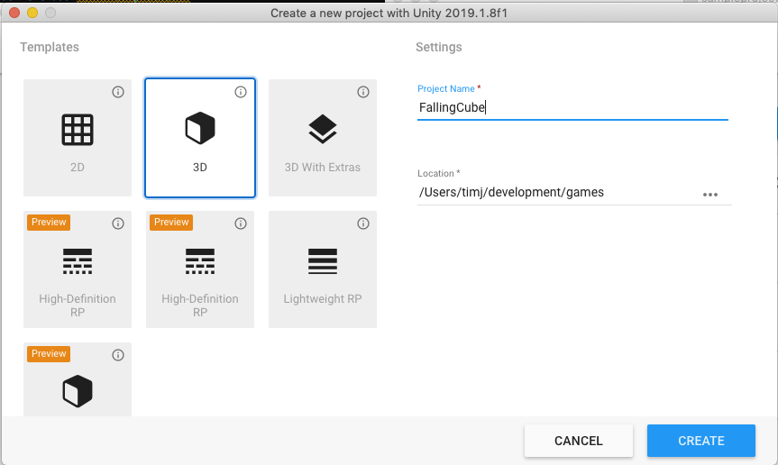
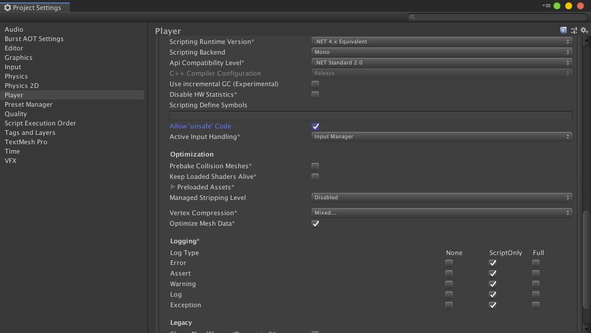
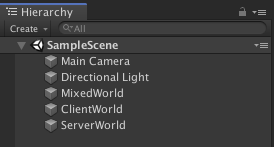
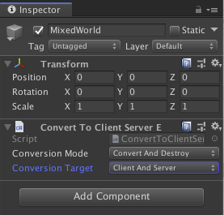
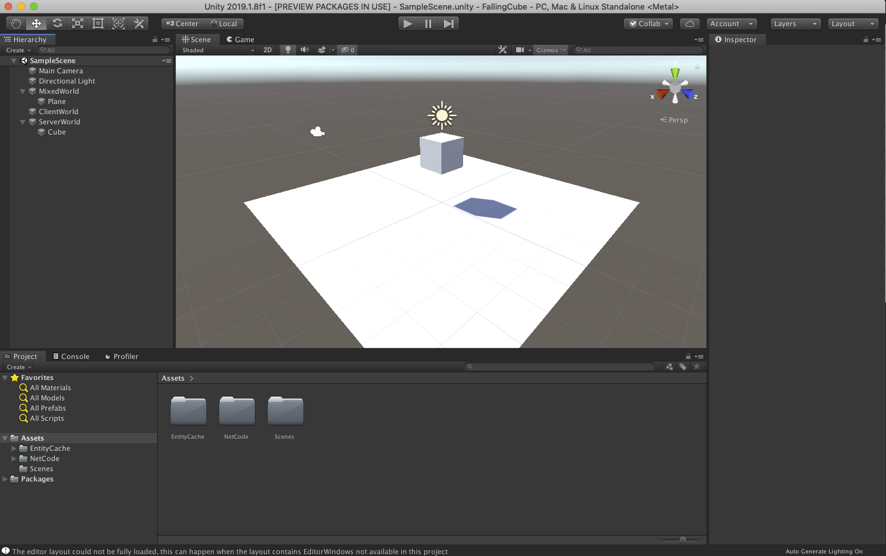
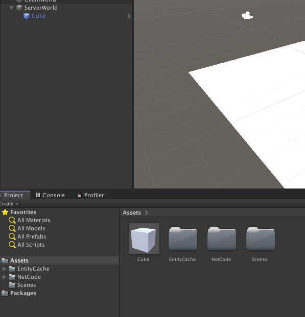
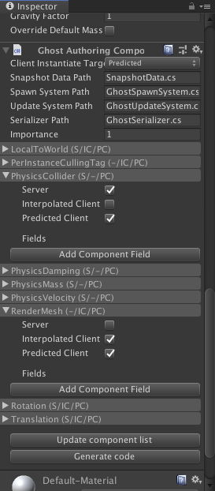
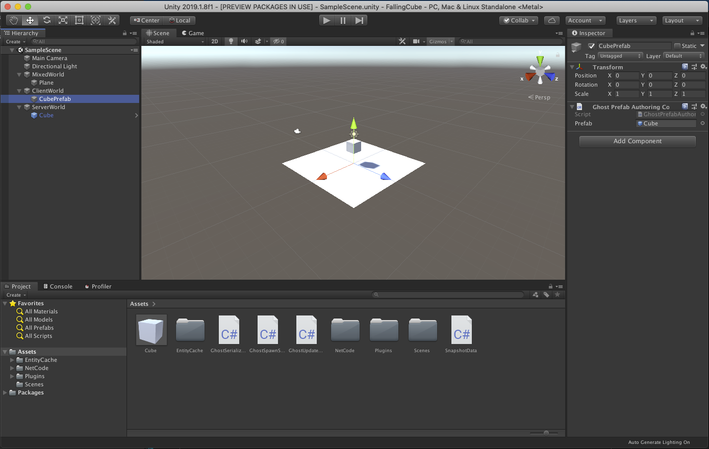

# DOTS NetCode quick start guide
This doc is a walkthrough of how to create a very simple client / server based simulation.

## Setup the project
The first step is to create a new project. From the hub we create a new project called "FallingCube".



We need to add some packages to the new project, so open `Window > Package Manager`, make sure "Show preview packages" under "Advances is enabled and add the packages `Entities`, `Hybrid Renderer` and `Unity Physics`.

Next we need to copy some code from the multiplayer repo (https://github.com/Unity-Technologies/multiplayer). First we need to copy `com.unity.transport` from `multiplayer/com.unity.transport` to `FallingCube/Packages/com.unity.transport`. On mac this would be a command similar to `cp -R ../multiplayer/com.unity.transport Packages` assuming FallingCube and multiplayer are in the same repo and you are currently in the FallingCube folder. Next we need to copy `multiplayer/sampleprojects/Assets/NetCode` to `FallingCube/Assets/NetCode`, this would be something like `cp -R ../multiplayer/sampleproject/Assets/NetCode Assets`.

The collection we create later requires unsafe code, so open `Edit > Project Settings...` and enable unsafe code under player settings.



## Create the initial scene
In order to get something running we need to setup the scene in a special way to separate the data between what is available on the client and server. We start by creating GameObjects for `MixedWorld`, `ClientWorld` and `ServerWorld`.



On each of these world GameObjects we need to add the component `ConvertToClientServerEntity`. The component has a dropdown where you can select "Conversion Target", the target should be "Client And Server" for `MixedWorld`, "Client" for `ClientWorld` and "Server" for `ServerWorld`.



Next we need to add a plane for the cube to fall onto. This needs to be in both worlds, so we create a plane under `MixedWorld`, right click `MixedWorld` and select `3D Object > Plane`. We also need to create a cube which falls onto the plane on the server, so we add a cube under `ServerWorld`, right click `ServerWorld` and select `3D Object > Cube`.



Finally, to make sure the cube falls we need to add a `Physics Body` component to it.


## Create the ghost prefab
To make this scene run with a client / server setup we need to create a definition of the networked object - called a ghost. To do that we need to create a prefab by dragging the "Cube" GameObject to the Assets panel in Unity.



Next we add a `Ghost Authoring Component` to the prefab. In the inspector for the `Ghost Authoring Component` we can update the list of components by clicking "Update component list". The Translation and Rotation components should get values setup by default. All we need to do is expand the components in this list and select where they should be present. In our case we want to disable `PhysicsCollider`, `PhysicsDamping`, `PhysicsMass` and `PhysicsVelocity` on interpolated clients, and we want to disable `PerInstanceCullingTag` and `RenderMesh` on the server. This is because the server is not supposed to render anything, and interpolated objects on the client are not supposed to simulate anything.



With this in place we click "Generate Code" in the `Ghost Authoring Component`.

### Bug workaround
Unfortunately that gives us compile errors. In order to fix those compile errors we need to open `GhostSpawnSystem.cs` and add
```c#
using Unity.Rendering;
using Unity.Physics;
```
We also need to open `GhostSerializer.cs` and add
```c#
using Unity.Physics;
```

Next we need to create an entity prefab for the client to instantiate. Under `ClientWorld` we create an empty GameObject and add the `Ghost Prefab Authoring Component` to it. We setup the Prefab field of that component to reference the Cube prefab (just drag the prefab from assets to the field in the inspector).



## Hooking up the collections
In order for the NetCode to know which ghosts and RPCs to use we need to generate collections. Go into `Multiplayer > CodeGen > GhostCollection Generator` and in the window click "Scan for ghosts" followed by "Generate Collection".

We are not using RPCs in this example, but we still need to generate the RPC collection for the built-in RPC calls to work. So go into `Multiplayer > CodeGen > RpcCollection Generator`, click "Generate Collection" and save the file in the Assets folder of the FallingCube project.

## Establishing a connection
The last thing we need to do is make sure the server starts listening for connections, the client connects and all connections are marked as "in game" so the NetCode start sending snapshots. We do not need a full flow in this case, so we will just write the minimal amount of code to set it up. Create a file called `FallingCubeSystem.cs` under Assets and add this code to it.
```c#
using System.Linq;
using Unity.Entities;
using Unity.Networking.Transport;

public class FallingCubeSystem : ComponentSystem
{
    protected override void OnCreateManager()
    {
        // If this system is created in the server world, start listening
        // If this system is created in a client world, connect
        var ep = NetworkEndPoint.LoopbackIpv4;
        ep.Port = 51234;
        if (World == ClientServerBootstrap.serverWorld)
            World.GetOrCreateSystem<NetworkStreamReceiveSystem>().Listen(ep);
        else if (ClientServerBootstrap.clientWorld.Contains(World))
            World.GetOrCreateSystem<NetworkStreamReceiveSystem>().Connect(ep);
    }

    protected override void OnUpdate()
    {
        // If there are any connection entities which are not yet in game, mark them as in-game right away
        Entities.WithNone<NetworkStreamInGame>().ForEach((Entity entity, ref NetworkStreamConnection connection) =>
        {
            PostUpdateCommands.AddComponent(entity, new NetworkStreamInGame());
        });
    }
}
```

## Testing it
Now everything should be good to go. Open `Multiplayer > PlayMode Tools` and make sure "PlayMode Type" is set to "Client & Server". Enter playmode and you should see the cube falling. All physics is simulated on the server, the positions are sent over a socket to the client and the client renders the cube.